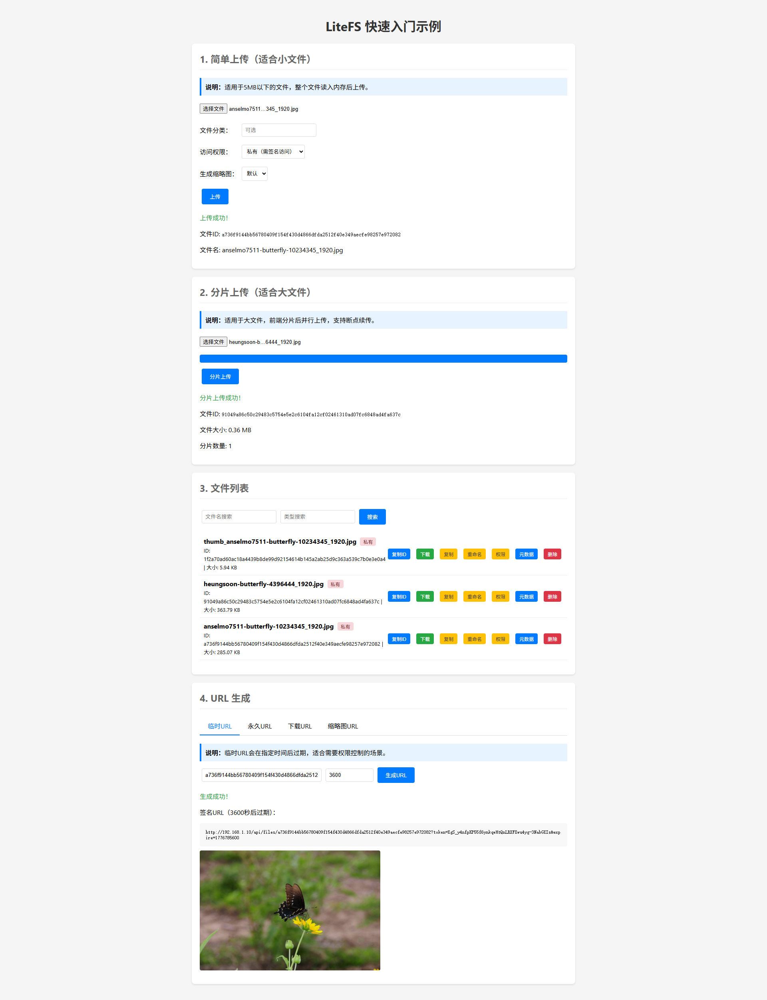

# LiteFS 快速开始

> 本文档帮助您在 5 分钟内快速上手 LiteFS

## 前置条件

- JDK 17+
- Maven 3.6+
- Spring Boot 3.x 项目

## 快速开始

### 步骤 1: 添加依赖

```xml
<dependency>
    <groupId>io.github.fangyudev</groupId>
    <artifactId>litefs-spring-boot-starter</artifactId>
    <version>1.0.0</version>
</dependency>
```

### 步骤 2: 添加配置

> 💡 提示：所有默认配置专为**单机模式**快速开发测试设计，开箱即用，无需修改 `application.yml`。

#### 单机模式（开发测试）

无需任何配置，使用全部默认值即可：

- 本地文件存储：`./data/files`
- H2 嵌入式数据库：`./data/litefs`
- 直接访问模式：无需网关
- 本地内存缓存/队列：无外部依赖

#### 生产环境推荐配置

生产环境需要修改以下关键配置（仅列出需修改项，其他保持默认即可）：

```yaml
litefs:
  # 必须修改：签名密钥（请使用复杂密钥）
  access:
    signed:
      secret-key: your-complex-secret-key-at-least-32-chars

  # 推荐：MySQL 元数据存储
  storage:
    metadata-type: mysql
    jdbc-url: jdbc:mysql://your-db-host:3306/litefs
    jdbc-username: your-username
    jdbc-password: your-password

  # 推荐：Redis 分布式缓存（提升性能）
  cache:
    enabled: true
    type: redis
    redis:
      host: your-redis-host
      password: your-redis-password

  # 分布式模式需启用
  remote:
    enabled: true

  # 分布式模式必须：Redis 消息队列
  replication:
    queue:
      type: redis
      redis:
        host: your-redis-host
        password: your-redis-password

  # 分布式模式必须：Redis 分片存储
  multipart:
    store-type: redis
    redis:
      host: your-redis-host
      password: your-redis-password
```

> ⚠️ **安全提示**：`access.signed.secret-key` 在生产环境**必须**修改为复杂密钥，否则签名验证形同虚设！

### 步骤 3: 使用 FileClient

```java
@Service
public class FileService {

    @Autowired
    private FileClient fileClient;

    public String uploadFile(MultipartFile file) throws IOException {
        return fileClient.upload(
            file.getInputStream(),
            file.getOriginalFilename(),
            Map.of("uploadedBy", "user-123")
        );
    }

    public InputStream downloadFile(String fileId) {
        return fileClient.download(fileId);
    }

    public String getFileUrl(String fileId) {
        return fileClient.getUrl(fileId);
    }
}
```

## 运行示例项目

克隆代码后可直接运行示例项目体验完整功能：

```bash
cd litefs-example
mvn spring-boot:run
```

启动成功后，浏览器访问 `http://localhost:8080/quickstart/index.html`，即可看到如下示例界面：



## 下一步

- [安装和配置](INSTALLATION.md) - 详细的安装配置说明
- [API 使用指南](../user-guide/API_GUIDE.md) - 完整的 API 使用文档
- [配置参考手册](../user-guide/CONFIGURATION.md) - 所有配置项说明
- [常见问题](../user-guide/FAQ.md) - 问题解答

## 常见问题

### 如何切换到 MySQL？
修改 `metadata-type: mysql` 并配置 `jdbc-url`、`jdbc-username`、`jdbc-password`。

### 如何配置网关访问？
默认使用直接访问模式。如需通过网关访问，添加配置：
```yaml
litefs:
  access:
    url-type: gateway
    gateway:
      base-url: http://your-gateway.com
      path-prefix: /api/files
```
